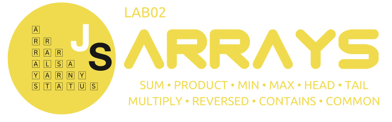

<div align="center">




&nbsp;

&nbsp;

&nbsp;

&nbsp;

&nbsp;

---

</div>

[TOC]

# Due Date

~~Week 3 Monday 6:00 pm [Sydney Local Time](https://www.timeanddate.com/worldclock/australia/sydney)~~

For 24T2, there will be a 24-hour extension since Monday 10/06/2024 falls on the the King's Birthday. The lab
is thus due at:
- Week 3 Tuesday 6:00 pm [Sydney Local Time](https://www.timeanddate.com/worldclock/australia/sydney)

# Background

## Rationale

Have you ever made a shopping list? If you have, you would know that sometimes we need to
sum up the prices, find the most expensive item (probably to get rid of), find common items between two lists to avoid double-buying, and so on.

Introducing: Javascript arrays - these are perfect when dealing with an ordered collection of items! In this lab, we will be bringing to life an interface that allows us to directly manipulate arrays of integers and perform common operations that you will find useful in COMP1531 and beyond.

## Setup
- If you are working on a CSE machine (e.g. via VLAB), ensure that you've run the command `1531 setup`. You only need to do this once at the beginning of the course.
- Copy the SSH clone link from Gitlab and clone this repository on either VLAB or your local machine. 
- In your terminal, change your directory (using the `cd` command) into the newly cloned lab. To check if you have done this correctly, type `ls` in this new directory to see if you can see the relevant files (including [array.js](array.js)).

## Interface: Functions

| Name & Description | Parameters | Return Type | Errors |
|------------------|----------|--------------------|------|
| `arraySum`<br/><br/>Compute the sum of the given integer array.<br/><br/>If the given array is empty, the sum is 0. <br/><br/><b>Difficulty</b>: ⭐ | (array) | `number` | N/A |
| `arrayProduct`<br/><br/>Compute the product of the given integer array.<br/><br/>If the given array is empty, the product is 1. <br/><br/><b>Difficulty</b>: ⭐ | (array) | `number` | N/A |
| `arrayMin`<br/><br/>Find the smallest number in the array. <br/><br/><b>Difficulty</b>: ⭐ | (array) | `number` | Return `null` If the given array is empty |
| `arrayMax`<br/><br/>Find the largest number in the array. <br/><br/><b>Difficulty</b>: ⭐ | (array) | `number` | Return `null` If the given array is empty |
| `arrayContains`<br/><br/>Determine if the array contains a particular integer element. <br/><br/><b>Difficulty</b>: ⭐ | (array, item) | `boolean` | N/A |
| `arrayReversed`<br/><br/>Create an array that is the reversed of the original. The original array should not be modified. <br/><br/><b>Difficulty</b>: ⭐ | (array) | `number[]`, or `Array<number>` | N/A |
| `arrayHead`<br/><br/>Returns the first element in the array. <br/><br/><b>Difficulty</b>: ⭐ | (array) | `number` | Return `null` If the given array is empty |
| `arrayTail`<br/><br/>Returns all remaining elements in the array after the head. If the input array contains one element, an empty array is returned.<br/><br/><b>Difficulty</b>: ⭐ | (array) | `number[]`, or `Array<number>` | Return `null` If the given array is empty |
| `arraysMultiply`<br/><br/>Given two arrays, multiply the elements at each index from arrays and store the result in a third array.<br/><br/>If the given two arrays differ in length, excess elements of the larger array will be added on at the end. <br/><br/><b>Difficulty</b>: ⭐⭐ | (array1, array2) | `number[]`, or `Array<number>` | N/A |
| `arraysCommon`<br/><br/>Create a third array containing common elements between two arrays.<br/><br/>Each element in the first array can map to at most one element in the second array, and vice versa (one-to-one relationship).<br/><br/>Duplicated elements in each array are treated as separate entities.<br/><br/>The order is determined by the first array. <br/><br/><b>Difficulty</b>: ⭐⭐⭐ | (array1, array2) | `number[]`, or `Array<number>` | N/A |

### Tip

- For some of the functions above, further examples are provided in their documentation in [arrays.js](array.js).
- **The original array passed in for each function should not be modified**. We have emphasised this in a few functions that are likely to cause issues, marked with `WARNING`.

## Interface: Data Types
| If the variable name | It is of type |
| --- | --- |
| contains **array** | `number[]`, which is the same as `Array<number>` and denotes an array of numbers such as `[1,2,3]`  |
| is exactly **item** | `number`, specifically integer |

# Task

## Implementation

Open the file [array.js](./array.js) in your preferred text editor. The stub code for each function has been provided for you.

Complete each function in [Interface: Functions](#interface-functions).

## Run & Debug

You can run and debug your code by typing the following in a terminal opened in the directory (folder) for this lab:

```shell
$ node array.js
```

## Output format of console.log

When debugging your code, you *may* find that the output of `console.log` has:
- different colours (e.g. yellow/brown for numbers)
- different spacing (e.g. spaces between brackets)
- new lines (e.g. after an opening bracket)
- other slight differences in indentation, commas, etc

This is completely fine. What matters is the returned value of your functions, which is what we will be assessing you on.

Using `console.log` is strictly for debugging purposes. It will not affect your mark in any way. In other words, how your results are displayed when printed or whether you leave these `console.log` statements in your code has 0 effects on your final automarking result.

# Submission

- Use `git` to `add`, `commit`, and `push` your changes on your master branch.
- Check that your code has been uploaded to your Gitlab repository on this website (you may need to refresh the page).

**If you have pushed your latest changes to master on Gitlab no further action is required! At the due date and time, we automatically collect your work from what's on your master branch on Gitlab.**

# Notes
- Pay close attention to any `WARNING` or when a function can have multiple return types, e.g. `{number|null}`.
- Passing the given tests is a good indication of correctness but does not guarantee that you will receive the full mark for the lab.
- You are advised to do further testing.
- You may find the resource below useful:
    - https://developer.mozilla.org/en-US/docs/Web/JavaScript/Reference/Global_Objects/Array
- You are not allowed to use any external libraries/modules in this exercise. This means your code should run without needing to use the command `npm install`.
- For this lab, and all future labs, you are allowed to use any features of NodeJS that runs on a CSE machine, unless explicitly stated otherwise in the specification. For example, `Math.min`, `Math.max`, `Array.find` and so on are all built-in features of NodeJS that can be used.
