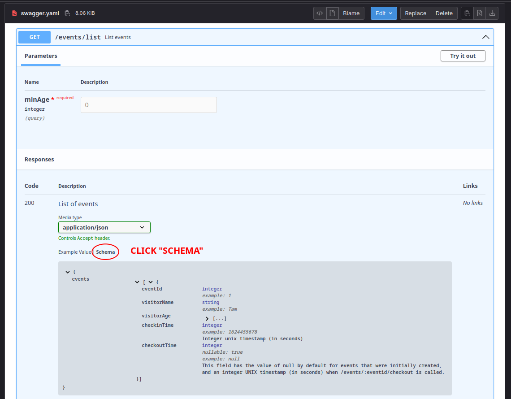

<div align="center">


&nbsp;

&nbsp;

&nbsp;

&nbsp;

&nbsp;

---

</div>

[TOC]

# Due Date

Week 5 Saturday 10:00 pm [Sydney Local Time](https://www.timeanddate.com/worldclock/australia/sydney)

# Background

## Rationale

With over 2200 public schools in NSW, the Service Planning Department of School Infrastructure needs a way to monitor
daily visitors at each school for further analysis and future planning.

Being a recent recruit of the specialised Digitalisation team, you have been tasked with the transition of an existing
[MVP](https://www.atlassian.com/agile/product-management/minimum-viable-product) backend service into a
[RESTful Web API](https://aws.amazon.com/what-is/restful-api).
Your co-workers have already completed the swagger documentation and HTTP tests before you were recruited -
it is now up to you to push this project across the finish line!

## Getting Started
- Copy the SSH clone link from Gitlab and clone this repository on either VLAB or your local machine.
- In your terminal, change your directory (using the `cd` command) into the newly cloned lab.

Before starting, **please make sure that you've seen last week's lectures (week 4)**!

You may also find the following projects helpful:
- tutorial 5 express exercise, or if this is before your tutorial:
- Week 5 Server Example
    - https://nw-syd-gitlab.cseunsw.tech/COMP1531/24T2/week5-server-example
    - we recommend reading through the sample implementation and complete some of the "OPTIONAL ACTIVITY" in the two test files.

## Express Installation

*[Express](https://expressjs.com/) is a fast, unopinionated minimalist web framework for Node.js*. To get started,

1. Open [package.json](package.json) and look at existing packages in `"dependencies"` and `"devDependencies"`. Install them with:
    ```shell
    $ npm install
    ```

1. Install [express](https://www.npmjs.com/package/express), along with the middlewares
    - [cors](https://www.npmjs.com/package/cors) to allow access from other domains (needed for frontend to connect)
    - [morgan](https://www.npmjs.com/package/morgan) (OPTIONAL) to log (print to terminal) incoming HTTP requests.
    ```shell
    $ npm install express cors morgan
    ```

1. Install the type definitions for the dependencies above as development dependencies:
    ```shell
    $ npm install --save-dev @types/express @types/cors @types/morgan
    ```

1. Finally, we will install
    - [ts-node-dev](https://www.npmjs.com/package/ts-node-dev) (OPTIONAL, but HIGHLY RECOMMENDED)
        - to run our server in debug mode
        - automatically restart the server when changes are made to the code
    - [sync-request-curl](https://www.npmjs.com/package/sync-request-curl)
        - for testing purposes
        - we will use this to send HTTP requests to our server
        - please **read the documentation for this package** - if it bugs out on npm, you can view the docs on [Github](https://github.com/nktnet1/sync-request-curl) instead
    ```shell
    $ npm install --save-dev ts-node-dev sync-request-curl
    ```

1. Open your [package.json](package.json) and add the following scripts:
    ```json
    "scripts": {
        "test": "jest",
        "ts-node": "ts-node",
        "ts-node-dev": "ts-node-dev",
        "tsc": "tsc --noEmit",
        "lint": "eslint '**/*.ts'"
        // Any other scripts you want here
    }
    ```

1. Tip: for convenience, you may also add `ts-node` in a `start` script to run [src/server.ts](src/server.ts):
    ```json
    "start": "ts-node src/server.ts",
    "start-dev": "ts-node-dev src/server.ts",
    ```
    Similar to `test`, `start` is a special value in `npm`. Thus, either of the below will work:
    ```shell
    $ npm run start
    $ npm start
    ```

1. To check that you have completed the steps correctly, compare your [package.json](package.json) with our sample package.json in the [Additional Information](#additional-information) section.

1. Use `git` to `add`, `commit` and `push` your [package.json](package.json) and [package-lock.json](package-lock.json).

1. (Optional) Update [.gitlab-ci.yml](.gitlab-ci.yml) with testing and linting.

## Interface

See [swagger.yaml](swagger.yaml).

Note that in addition to the "Example Value" tab that shows a valid sample/stub return value, you can also view the schema of the response.
This will often contains further descriptions or constraints.

For example, take a look at the `checkoutTime` for `GET` `/events/list`:


# Task

## Testing

See [src/root.test.ts](src/root.test.ts) and [src/echo.test.ts](src/echo.test.ts) for examples of how you can write HTTP tests with [sync-request-curl](https://www.npmjs.com/package/sync-request-curl). **Make sure to remove the redundant tests and uncomment the correct ones**.

You can create as many test files or directories as you like. The quality of your tests will be assessed, so aim to cover as many different cases as possible.

The file [src/checkins.test.ts](src/checkins.test.ts) has been populated with a few tests for you to help get you started. Complete all the `test.todo`, and add any further tests you deem necessary after reading the [swagger.yaml](swagger.yaml) file.

You should **only be testing the HTTP layer**. This is done by sending requests to the server and checking the responses. The idea of "functions" or "data store" are considered implementation details and should not be imported or tested directly in any test file (this is because the level of abstraction has shifted to HTTP, so our black-box tests can only operate at this level). Your test should work for another student's implementation of the server.

To test your code, you will need to use two different terminals:

<table>
    <tr>
        <th><b>Terminal 1 - Server</b></th>
        <th><b>Terminal 2 - Test</b></th>
    </tr>
    <tr>
        <td>
            <code>$ npm run ts-node src/server.ts</code>
        </td>
        <td>
            <code>$ npm test</code>
        </td>
    </tr>
</table>

## Implementation

The core logic of the application has already been implemented for you in [src/checkins.ts](src/checkins.ts).

After completing the test suite in the previous section, your task is to
1. read through the file [swagger.yaml](swagger.yaml) to understand the API requirements and input/output of each route
1. read through the file [src/checkins.ts](src/checkins.ts) to understand the existing functions and its input/output
1. transform the checkins service into a backend web server using [express](https://www.npmjs.com/package/express) **by modifying the file [src/server.ts](src/server.ts)**.

Note:

- When reading from the JSON body (i.e. with `req.body`), the types of all properties will be correct and does not require type casting.

- When reading from the URL params, (i.e. with `req.params`), the types will need to be explicitly casted, e.g. for `eventid` as a number:
    ```ts
    const eventId = parseInt(req.params.eventid as string);
    ```

- When reading from the query string (i.e. with `req.query`), the types will need to be explicitly casted, e.g. for `minAge` as a number:
    ```ts
    const minAge = parseInt(req.query.minAge);
    ```

## Swagger API

If you wish to use the "Try it out" button to send requests to your server directly, click on the dropdown to open the instructions below.

<details close>

<summary>Instructions for adding dynamic swagger route</summary>

1. Install the necessary dependencies

    ```shell
    $ npm i yamljs swagger-ui-express
    $ npm i -D @types/yamljs @types/swagger-ui-express
    ```

1. Add the following imports at the top of [src/server.ts](src/server.ts):
    ```typescript
    import YAML from 'yamljs';
    import swaggerUi from 'swagger-ui-express';
    ```

1. Add the following lines directly below the definition of your `app` (i.e. below the line `const app = express()`) in [src/server.ts](src/server.ts):

    ```typescript
    const swaggerDocument = YAML.load('./swagger.yaml');
    app.use('/api-docs', swaggerUi.serve, swaggerUi.setup(swaggerDocument));
    ```

1. Access your server from the browser and follow the `/api-docs` path. For example, assuming your server is running on port `49152`, this would be:

    ```
    http://127.0.0.1:49152/api-docs/
    ```

</details>

## API Clients

If you are using an API Client such as ARC, Insomnia or POSTMAN, be mindful that to send a valid body for PUT/POST requests, you should:
1. Check that the `"Body content type"` is set as `"application/json"`
1. Your `JSON` string uses double quotes (`""`) for both keys and values

On VLAB (and **not** VSCode SSH-FS, which isn't supported),

1. ARC can be run with:
    ```shell
    $ 1531 arc
    ```
1. Insomnia can be run with
    ```shell
    $ 1531 insomnia
    ```
1. Postman can be run with
    ```shell
    $ 1531 postman
    ```

If you are working locally and wish to use these tools, you are advised to look up the instructions specific to your environment.

## Tips, Hints and Common Mistakes

1. If you see the error `ECONNREFUSED` in your tests, this could mean two things:
    1. The tests are not sending requests to a valid server. One common mistake is forgetting to add a leading slash, e.g. `echo` instead of the correct `/echo`. If this is the case, Jest would also be showing that port `80` is used instead of the value in your [config.json](config.json), i.e. `"connect ECONNREFUSED 127.0.0.1:80"`
    1. Your server has not been started successfully. Check the output of the terminal running your server to see why.

1. When starting your server, if you see an error message equivalent to `Error: listen EADDRINUSE: address already in use :::49152`, it is likely that:
    1. You are working on a CSE machine (e.g. through VLAB) and another student is using this port
    1. You have another terminal running a server on the same port (e.g. 49152)

    Try changing the port number in the file `config.json` to a different value and try again.

1. If your server encounters the error `ERR_HTTP_HEADERS_SENT`, this could mean that you are using `res.json()` more than once in your `server.ts`.
    - Note that, unlike `return`, this does not terminate the route and it is not possible to send a response twice for a single request.
    - This is why we recommend you abstract your code into a function in another file (which uses `return`), then simply use `res.json()` once in `server.ts` and treat the routes as "wrappers". Another workaround is:
        <details close>
        <summary>click to view</summary>

        ```js
        if (somethingCondition) {
            res.status(someStatus).json({});
            return;
        }
        res.json();
        ```
        or more simply,
        ```js
        if (somethingCondition) {
            return res.status(someStatus).json({});
        }
        res.json();
        ```

        </details>

1. If you receive an error with the code `404`, it means that the route you're requesting in your test cannot be found on your server. This is likely due to:
    - You not having implemented the route
    - There is a typo in either your test or server, e.g. `/events/list` in one and, incorrectly, `/event/list` in the other.
    - You are using `ts-node` (instead of `ts-node-dev` which automatically reloads on change) to start your server and have forgotten to manually restart the server to load the new changes.
    - You've forgotten a leading slash (`/`), e.g. you have `events/list` instead of `/events/list`

1. If you receive an error with the code `500`, this means that your server has crashed while handling a request. The best place to look for why this occurred would be the server log (the output of the terminal that you're running the server on)

# Submission

- Use `git` to `add`, `commit`, and `push` your changes on your master branch.
- Check that your code has been uploaded to your Gitlab repository on this website (you may need to refresh the page).

**If you have pushed your latest changes to master on Gitlab no further action is required! At the due date and time, we automatically collect your work from what's on your master branch on Gitlab.**

Afterwards, assuming you are working on a CSE machine (e.g. via VLAB), we strongly recommend that you remove your `node_modules` directory with the command:
```shell
$ rm -rf node_modules
```
This is because CSE machines only allow each user to have a maximum of 2GB, so you will eventually run out of storage space. It is always possible to `npm install` your packages again!

# Additional Information

## Sample package.json

<details>

<summary>Click to view our sample package.json</summary><br/>

**Note**:
1. The main keys to pay attention to are `"scripts"`, `"dependencies"` and `"devDependencies"`.
1. It is fine if the versions of your packages are newer.

```json
{
  "name": "lab05_checkins",
  "version": "1.0.0",
  "description": "[TOC]",
  "main": "src/server.ts",
  "scripts": {
    "start": "ts-node src/server.ts",
    "start-dev": "ts-node-dev src/server.ts",
    "test": "jest",
    "ts-node": "ts-node",
    "tsc": "tsc --noEmit",
    "lint": "eslint src/**.ts"
  },
  "keywords": [],
  "author": "",
  "license": "ISC",
  "devDependencies": {
    "@types/cors": "^2.8.12",
    "@types/express": "^4.17.13",
    "@types/jest": "^27.5.1",
    "@types/morgan": "^1.9.3",
    "@typescript-eslint/eslint-plugin": "^5.23.0",
    "@typescript-eslint/parser": "^5.23.0",
    "eslint": "^8.15.0",
    "eslint-plugin-jest": "^26.2.1",
    "jest": "^28.1.0",
    "ts-node-dev": "^2.0.0",
    "sync-request-curl": "^2.0.0",
    "ts-jest": "^28.0.2",
    "typescript": "^4.6.4"
  },
  "dependencies": {
    "cors": "^2.8.5",
    "express": "^4.18.1",
    "morgan": "^1.10.0",
    "ts-node": "^10.7.0"
  }
}
```

</details>

## Miscellaneous

<details>

<summary>Other information that is not core to the course</summary><br/>

1. You may have noticed that [jest.config.js](jest.config.js) is slightly different from lab04_encanto - it has the added key `maxWorkers: 1`.
    - This is so that test files run one at a time (i.e. synchronously, as opposed to asynchronously), otherwise we will run into issues with sync-request.
    - Async is beyond the scope of COMP1531 :).

</details>
